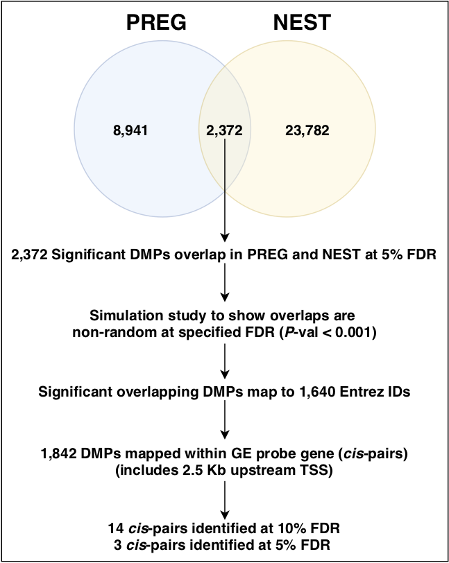
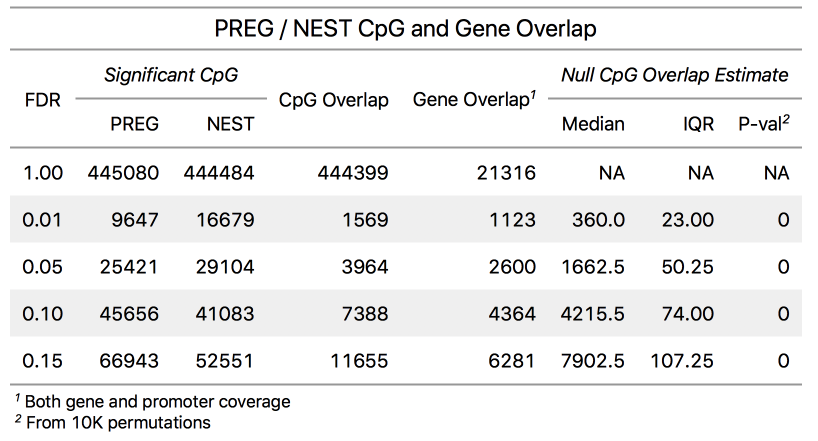
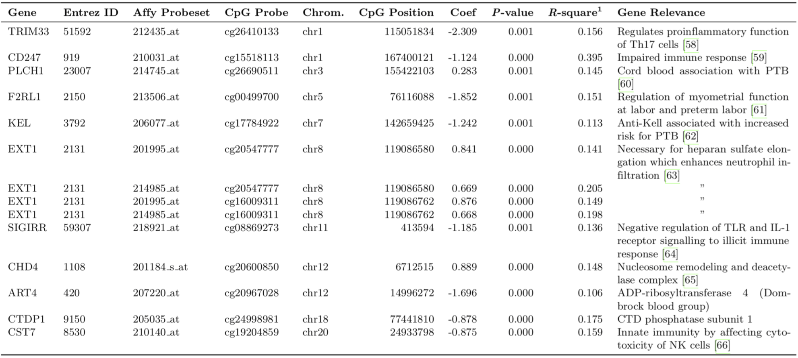
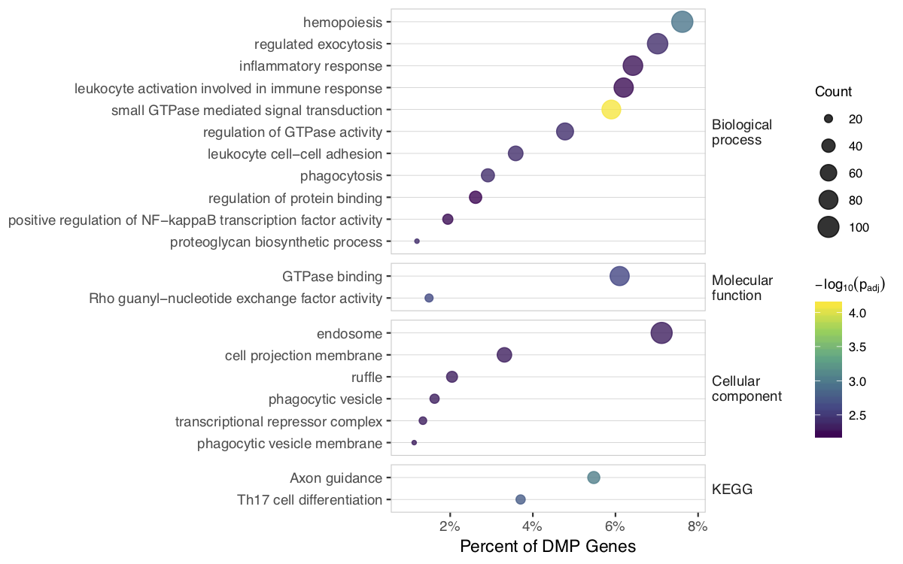

```{r, include=FALSE}
knitr::opts_chunk$set(results = 'asis',
                      echo = FALSE,
                      warning = FALSE,
                      tidy = FALSE,
                      message = FALSE,
                      fig.align = 'center',
                      out.width = "100%")
options(knitr.table.format = "html") 
```


## Introduction

DNA methylation (DNAm) is highly sensitive to in utero perturbations and has an established role in both early development and regulation of gene expression. The fetal genetic component has been shown to contribute significantly to timing of birth, yet little is known about the identity and behavior of individual genes.    


## Objectives

1. Test for association between **genome-wide DNAm** levels in umbilical cord blood with **gestational age at birth**.
2. **Validate** DNAm findings in an independent sample.
3. Multi-omic approach to evaluate DNAm cis-gene relationships with **gene expression regulation**.

## Methods

- Illumina Infinium Human Methylation 450K BeadChip:
  - Pregnancy, Race, Environment, Genes Study (**PREG** - VCU) (N= 124)
  - Newborn Epigenetic STudy (**NEST** - Duke) (N= 378) 
- Consistency of differentially methylated positions (DMPs) was assessed in multiple ways: 
  - Degree of overlap in cohorts was non-random by simulation study
  - Concordant in both direction of change and size of effects
- CpGs significant in both studies (FDR=5%) were tested for association with *cis*-gene expression


## Support
NIHMD (P60MD002256, PI: York, Strauss); NIEHS (R21ES014947, PI: Hoyo) and NIEHS (R01ES016772, PI: Hoyo); NIDDK (R01DK085173, PI: Hoyo).


```{r, flowchart-fig, fig.cap = 'PREG and NEST cohort DNA methylation array probe and sample filtering summary for major processing steps.', out.width = "90%"}


```


```{r, eval = TRUE, overlap-fig, fig.cap = 'Simulation study of overlapping CpG results from PREG and NEST', out.width = "70%"}


```


```{r, gene-list-fig, fig.cap = 'DMP *cis* Gene Expression Association.', out.width = "90%"}


```


```{r, enrichment-fig, fig.cap = 'Gene-based enrichment for Gene Ontology groups and KEGG pathways.', out.width = "90%"}


```


