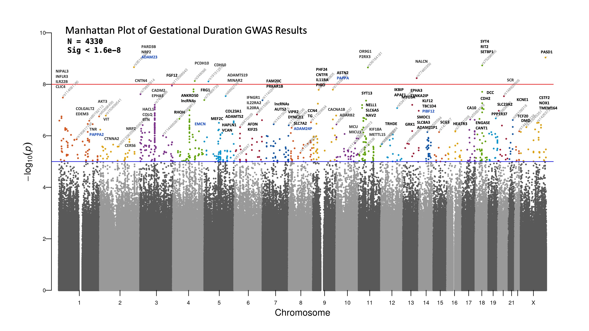
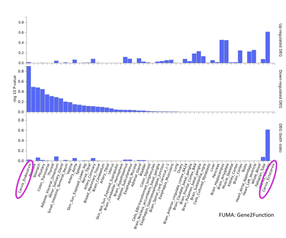
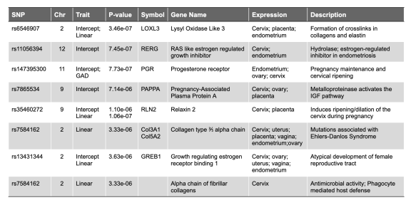

```{r, include=FALSE}
knitr::opts_chunk$set(results = 'asis',
                      echo = FALSE,
                      warning = FALSE,
                      tidy = FALSE,
                      message = FALSE,
                      fig.align = 'center',
                      out.width = "100%")
options(knitr.table.format = "html") 
```


## Introduction

Sonographic cervical length is a powerful predictor of spontaneous preterm birth (sPTB) and is used as part of clinical care to prevent preterm birth. Twin and family studies have established a maternal genetic heritability for sPTB ranging from 13 to 20%. **Yet, there are no corresponding estimates of heritability for mid-trimester cervical length or an understanding of how genetic factors contribute to changes in the cervix across pregnancy.**


## Objectives

1. Provide the first heribility estimate for cervical length change in pregnancy.
2. Estimate the extent to which genetic factors contributing to cervical length also influence pregnancy duration. (*i.e.*, genetic correlation).


## Methods

- Next-generation 1x sequencing was performed on maternal blood DNA from **5023** patients resulting in **19.8M** variants and **4413** samples after quality control.  
- The cervix was imaged via **transvaginal ultrasound** between **8** and **40 weeks** of gestation, with a median of 5 (IQR: 3-8) serial CL measurements recorded per pregnancy.
- Gestational age at assessment (GAA) and gesational age at delivery (GAD) were measured from the last menstrual period and confirmed by ultrasound.
- Pregnancy-specific change in CL during pregnancy was modeled as a non-linear **longitudinal growth curve**, described by an intercept **(I)**, linear slope **(L)**, and quadratic slope **(Q)**.
- Heritabilty and genetic correlations were estimated using Genome-wide Complex Trait Analysis (**GCTA**, Yang 2011).

<br>
<br>

## Results

```{r, intercept-fig, out.width = "100%", fig.cap = 'Cervical Length Gestational Duration GWAS Results.'}


```

```{r, slope-fig, out.width = "100%", fig.cap = 'GTEx Tissue Gene Expression Enrichment across CL GWAS.'}


```


```{r, snp-table, out.width = "100%", fig.cap = 'SNPs of Interest across Cervical Length GWAS.'}


```


## Conclusions

- **Cervical Length** change was influenced by **genetic** factors (heritability = 51%)
- Genetic risk for **GAD/sPTB** was highly shared with genetic risk for **Cervical Length** change.
- Suggests that a large proportion of genes for pregnancy duration exert their influence through cervical length change.


*This research was supported by funds from the Perinatology Research Branch of the NICHD/NIH/DHHS.*


